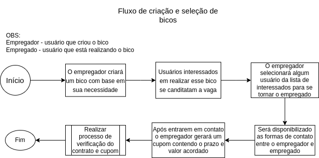
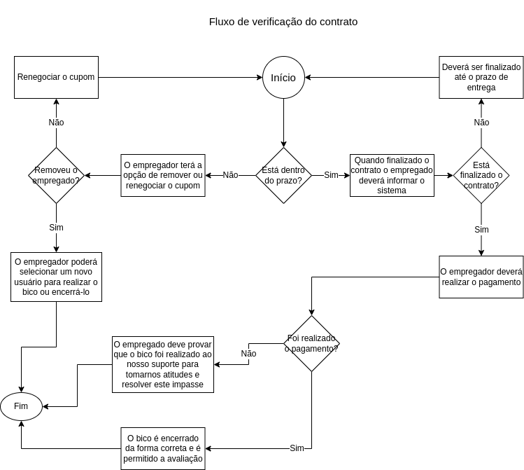

# API Fazendo um bico

## Funcionalidades:

### Usuário

- Registro com email e nome de usuário únicos
- Sistema de notififcações que daram um feedback dos bicos em que o usuário está de alguma forma inserido
- Criação de bicos com base em suas necessidades
- Oferecer seus serviços para cumprir os bicos
- O usuário possuirá uma nota com base na média de todos os contratos realizados e oferecidos
- Forma de contato entre empregador e empregado via whatsapp

### Bico

- Cada usuário se canditará para o bico e ficará em uma lista de interessados
- O usuário que oferece o bico escolherá alguém da lista de interessados para ser o empregado
- Após o empregado ser escolhido será possível ter acesso ao número de telefone um do outro para o contato
- Após o contato o empregador gerará um cupom que possui o prazo de entrega e valor com base no contato
  

### Verificação

- O empregado fará uma verificação que o bico foi finalizado
- Após o término do bico o empregado garantirá que o cupom foi pago
- Caso aprovado o término do bico e pagamento confirmado o empregador poderá finalizar o contrato do bico
- Caso o cupom passe do prazo de entrega o empregador poderá cancelar o bico e escolher um novo empregado
- Após a finalização será liberado o serviço de avaliação tanto para o empregador quanto para o empregado
  

## Autores:

- Matheus Dantas Ricardo
- Vinicius Bortolloti
- Vinicius Simizu